# ProxxonPID

Модифицированная версия проекта AlexGyver [DrillPID2](https://github.com/AlexGyver/DrillPID2), адаптированная для **Proxxon Micromot 50/E**.

Проект предназначен для замены штатной платы управления Proxxon Micromot 50/E на собственную плату с функцией поддержания заданной скорости вращения двигателя.

## Основные изменения

* плата разработана с учётом конструкции Proxxon Micromot 50/E и изготавливается в домашних условиях на однослойном текстолите методом ЛУТ;
* изменены `MAX_TARGET_EMF` и `DIV_R2` с учётом питания от 20 В;
* используется родной потенциометр с выключателем;
* добавлен индикатор работы на D13;
* [3D-модель](3D_models/PD_trigger_holder.3mf) крепления PD-триггера;
* проект платы выполнен в Altium Designer.

## Фотографии

### Proxxon Micromot 50/E

  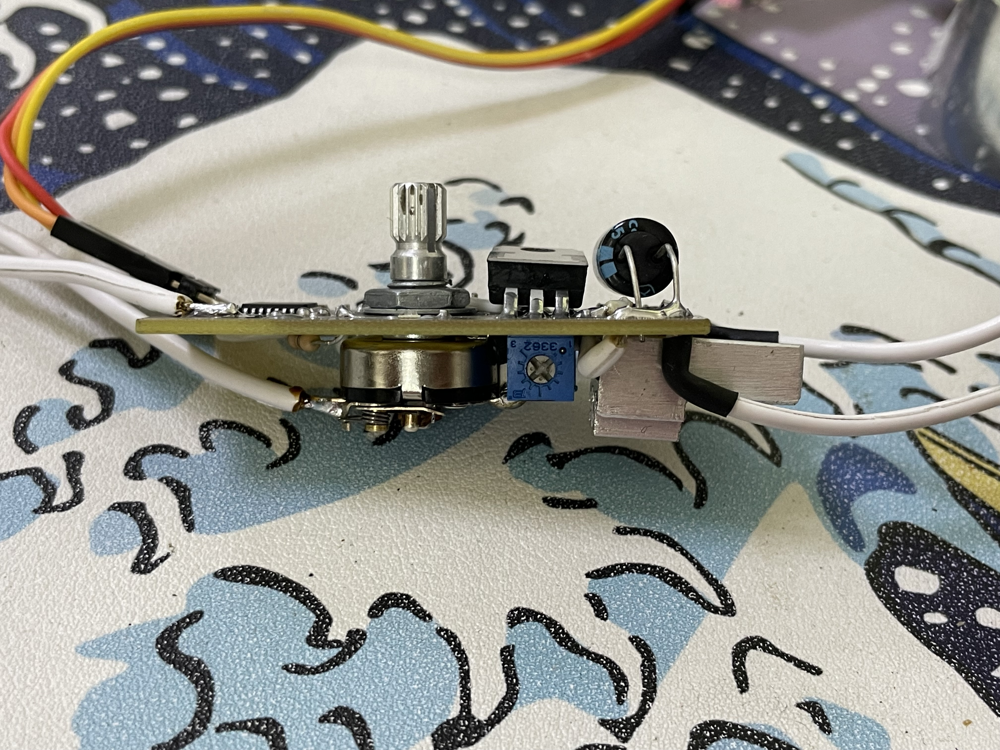
  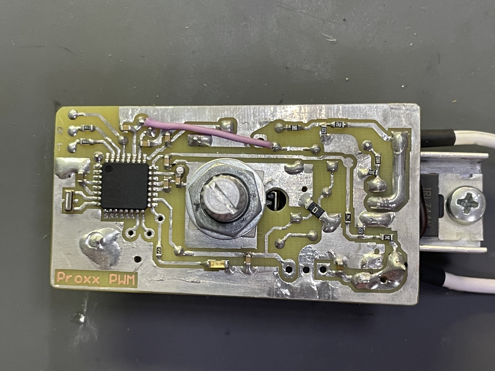
  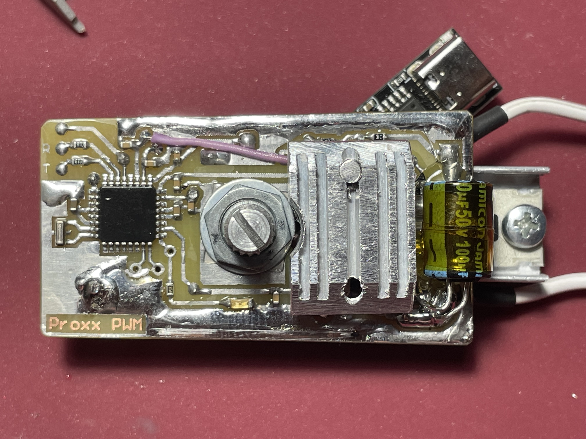

  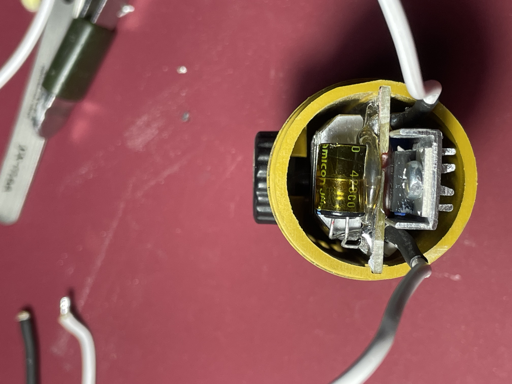
  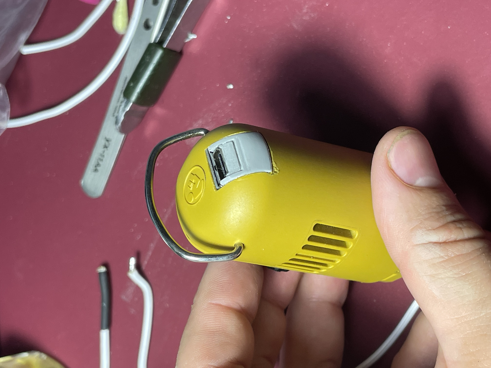
  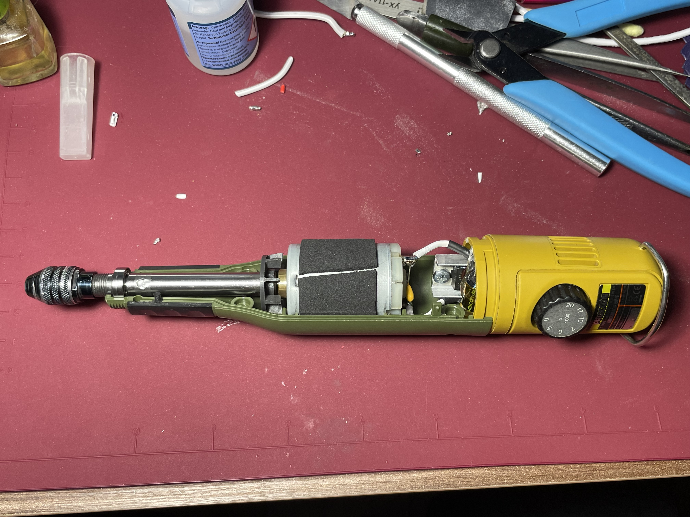

### Штатная плата

  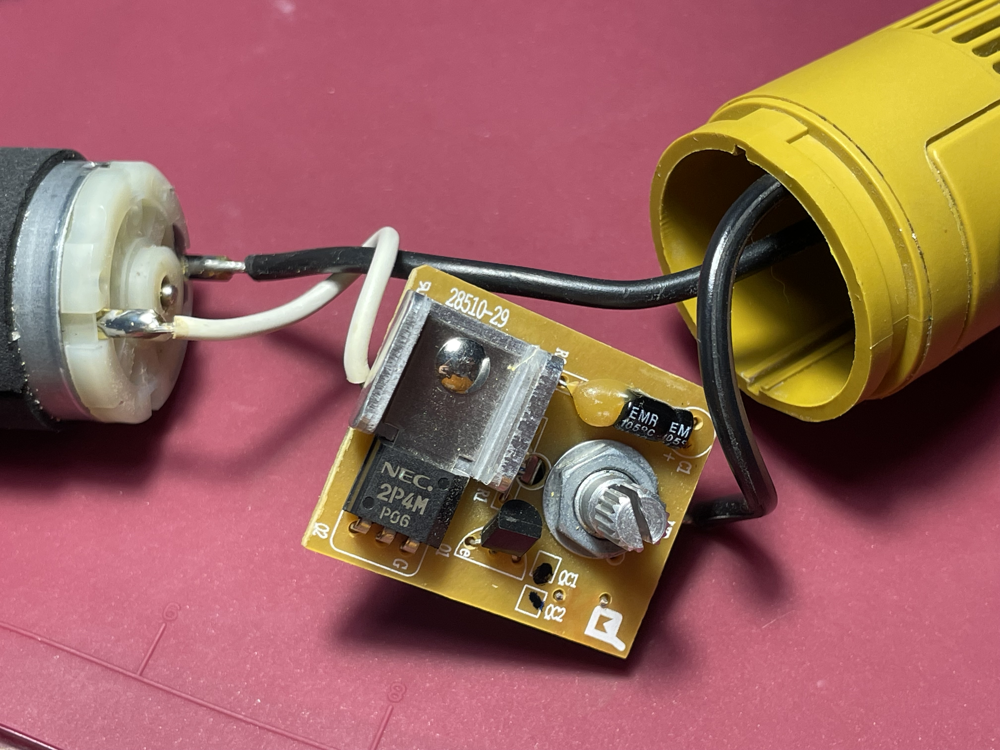
  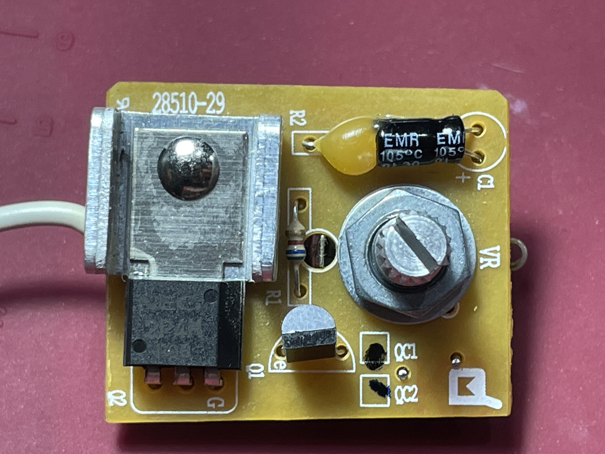
  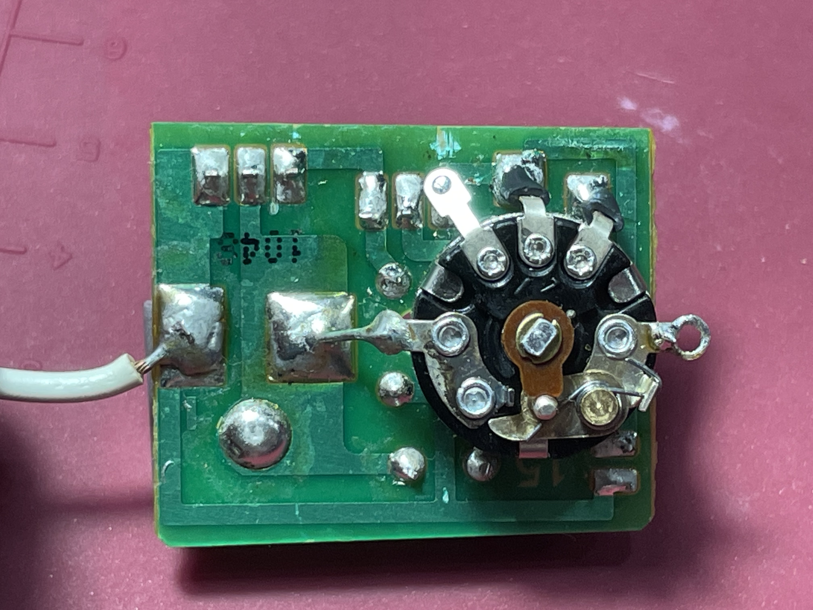

### PD-триггер

  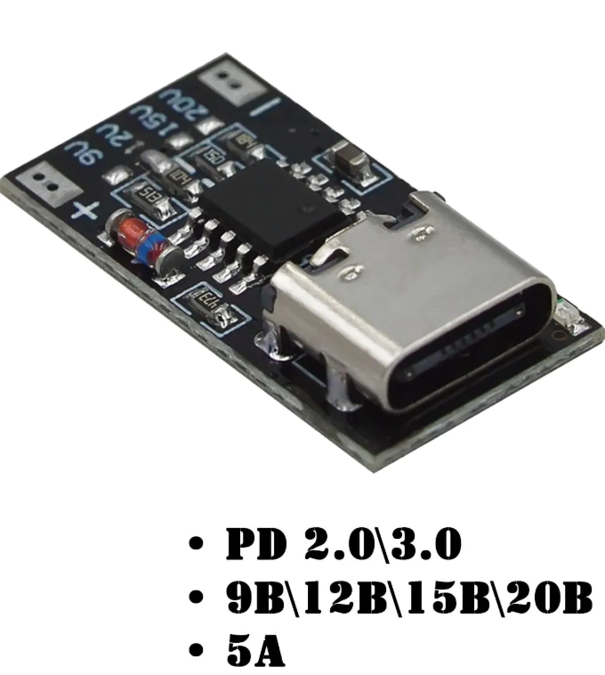
  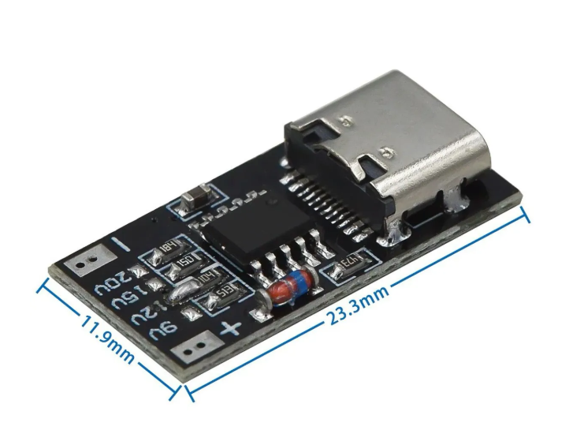

## Проект платы

Исходные файлы печатной платы находятся в каталоге [`PCB`](Altium_project/Proxxon_PWM_board).

Проект выполнен в **Altium Designer 25**.

## Прошивка

Прошивка для **Arduino Nano** находится в каталоге [`Firmware`](firmware/DrillPID2).

## Disclaimer

Проект предназначен для самостоятельного изготовления и модификации оборудования.

Использование проекта осуществляется на свой страх и риск. Автор не несёт ответственности за повреждение инструмента, электроники или иного оборудования в результате использования данной разработки.

---

# English

# ProxxonPID

A modified version of the AlexGyver [DrillPID2](https://github.com/AlexGyver/DrillPID2) project, adapted for the **Proxxon Micromot 50/E**.

The project is intended to replace the original control board of the Proxxon Micromot 50/E with a custom control board featuring **constant speed control**.

## Main Changes

* PCB designed specifically for the Proxxon Micromot 50/E and suitable for home manufacturing on single-sided PCB material using the toner transfer method;
* `MAX_TARGET_EMF` and `DIV_R2` values modified for a 20 V power supply;
* the original potentiometer with an integrated switch is retained;
* an operation indicator has been added to D13;
* [3D model](3D_models/PD_trigger_holder.3mf) of the PD trigger holder;
* PCB project designed in Altium Designer.

## Photos

### Proxxon Micromot 50/E

  
  
  

  
  
  

### Original Control Board

  
  
  

### PD Trigger

  
  

## PCB Project

The PCB source files are located in the [`PCB`](Altium_project/Proxxon_PWM_board) directory.

The project was designed using **Altium Designer 25**.

## Firmware

The **Arduino Nano** firmware is located in the [`Firmware`](firmware/DrillPID2) directory.

## Disclaimer

This project is intended for DIY manufacturing and modification of equipment.

Use this project at your own risk. The author is not responsible for any damage to the tool, electronics, or other equipment resulting from the use of this project.
